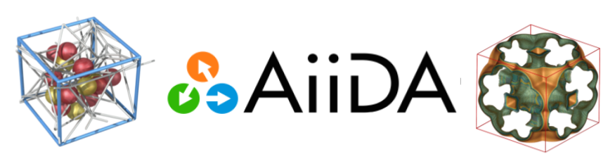

# aiida-lsmo-workflows
AiiDA workflows for the LSMO laboratory at EPFL
Development branch for AiiDA 1.0.0b5

## MultiCompIsothermWorkChain
The current version of work chain is able to perform zeo++ and RASPA
calculations for single and multi-component gas mixtures.

Two examples are provided with this work chain:
* [one-component isotherm simulation](https://github.com/pzarabadip/aiida-lsmo-workflows/blob/aiida-1.0.0b5/examples/run_isotherm_1comp_hkust1.py)
* [two-component isotherm simulation](https://github.com/pzarabadip/aiida-lsmo-workflows/blob/aiida-1.0.0b5/examples/run_isotherm_1comp_hkust1.py)
